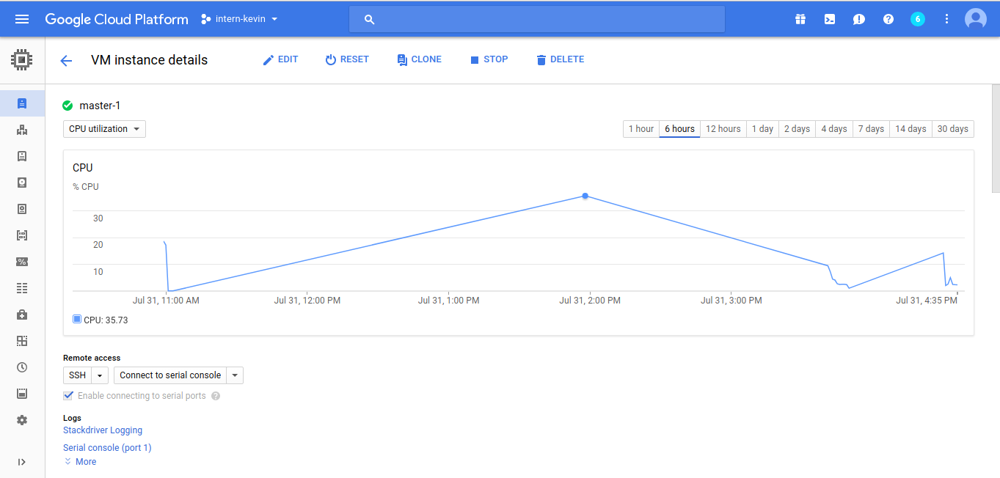

## LinuxKit
This Kubernetes setup still has limited features.
This instructions will install Kubernetes cluster on GCP with default configuration 1 master and 1 node instance.
In the end of this guide, you will have a working Kubernetes cluster without addons.

### Prerequisites
- **High memory (>8GB RAM)**
- Install Terraform (Recommended version : >0.9.8) [link](https://www.terraform.io/intro/getting-started/install.html)
- Docker [link](https://www.docker.com/get-docker)
- Moby & LinuxKit [link](https://github.com/linuxkit/linuxkit)


### Securing Kubernetes
In this project I use token authentication for Kubelet, Scheduler, and Controller-manager. 
Change tokens value in terraform/gce/terraform.tfvars
Run this command to generate token value


```
head -c 16 /dev/urandom | od -An -t x | tr -d ' '
```

Run this script 3 times and replace token value for kubelet, scheduler and controller.

More information about kubernetes token can be found [here](https://kubernetes.io/docs/admin/kubelet-tls-bootstrapping/)


Apiserver will authenticate user written in terraform/gce/module/compute/files/authorization-policy.jsonl.
You can edit this file to change authorization policy.
Each kubernetes component will present token and user to Apiserver using kubeconfig (e.g. kubelet will use ansible/roles/kubelet/templates/kubeconfig.j2 for its authentication).


### Change GCP Project
Change project name value in terraform/gce-linuxkit/terraform.tfvars

### Create GCP Bucket
Create a bucket to store image in GCP. Then change bucket_name value in terraform/gce-linuxkit/terraform.tfvars

### Create the machines with Terraform
Create VMs (I used GCE in this project) using terraform. Terraform can create and destroy instances using the same .tf files.

1. Go to terraform/gce-linuxkit directory
2. Configure the cloud provider in terraform/gce-linuxkit/terraform.tfvars, especially **project_id** and **cred_path**. Here is how to get gce json credentials for cred_path
[here](https://www.terraform.io/docs/providers/google/index.html#authentication-json-file), change the file path to your liking
3. Configure other variables in terraform/gce/terraform.tfvars. Multi master setup is now supported. If you have num_master > 1, Terraform will automatically create Load Balancer for master.
4. Master ip is created sequentially from ip_offset variable. If there are 2 master and ip_offset 2 and subnet range 10.20.0.0/24, then master-1 will have IP 10.20.0.2 and master-2 10.20.0.3.
5. Lb_offset variable will be used if num_master > 1. Change it so it will not collide with master and node IPs
6. Now open terminal in the same directory, run command :

    ```
    terraform get
    terraform apply
    ```

    Later if you want to delete or want to restart setup, use this command to delete all resources :

    ```
    terraform destroy
    ```

7. If the command ran succesfully, you should have Kubernetes cluster running

### Connecting to instances
You can only connect to LinuxKit instances using serial port connection in Google Cloud Console


### Install kubectl on LinuxKit

Run this command to install kubectl

```
apk update && apk add ca-certificates && update-ca-certificates && apk add openssl
wget https://storage.googleapis.com/kubernetes-release/release/v1.6.4/bin/linux/amd64/kubectl
chmod +x kubectl
mv kubectl /bin/kubectl
```

Check if all kubernetes containers are running

```
ctr t list
```

You could check if the nodes has registered using this command in master instance 

```
kubectl get nodes
```


## Testing
Notes : Whenever kubectl command is called, it should be done inside the master VM.

### Testing Service and Deployment
Even though your nodes are ready, you should test if your Service and Deployment can work well.

1. Run this command to deploy nginx application

    ```
    kubectl run nginx --image=nginx --port=80 --replicas=3
    ```

2. Check the pods' statuses

    ```
    kubectl get pods -o wide
    ```

    Make sure they are running

3. Expose the Service with type LoadBalancer

    ```
    kubectl expose deployment nginx --type LoadBalancer
    ```

4. Get the Service Port and External IP

    ```
    kubectl get svc
    ```

    Wait until the service got external IP

5. Test the nginx service using cURL or web browser :

    ```
    curl http://${SVC_EXTERNAL_IP}
    ```

6. Clean up

    ```
    kubectl delete deployment nginx
    kubectl delete svc nginx
    ```